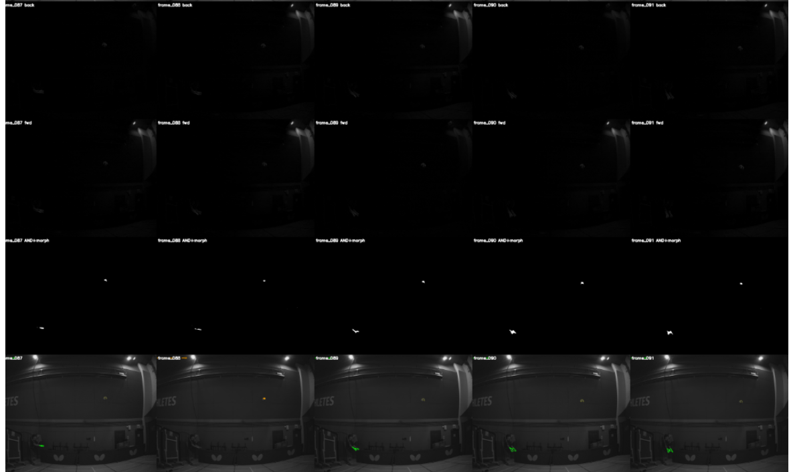
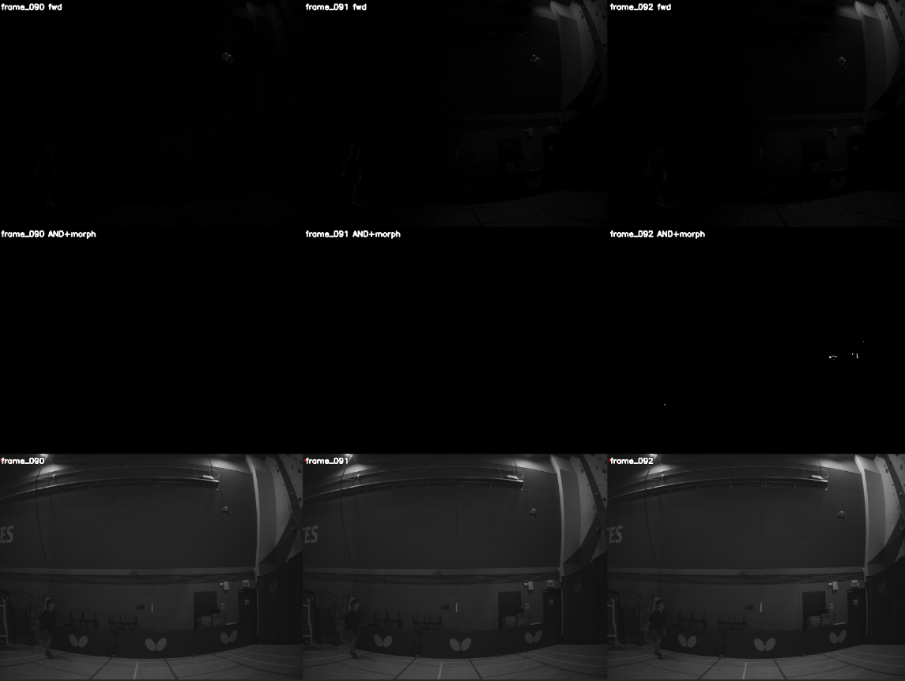

# Todos - 2026-07-25

## Critical / Blocking

- [ ] Double-check triangulation timestamp offset is under 7ms
      - Re-verify **per session**, not once - sync offset is stable within a session but random between sessions.
- [x] 21/07 flights (flight 61 onwards) use a **new world frame**
      - Do not mix with pre-flight-61 world registration in any batch analysis. Flag in filenames or a session manifest.

## Detection Validation

- [x] Sort flights into full flight vs non-full flights, extract ball frames
      - A couple flights may remain if still needed.
- [x] Run detector on all ball frames, get detection rate, tune (stride variations, 3-frame AND threshold)
- [ ] Label flights 1, 11, 33 to refine detection algorithm
  - [x] Label flight 1
  - [ ] Label flight 11
  - [ ] Label flight 33
- [ ] Decide: label more flights to validate recall, or iterate `min_run_length`?
      - **[Likely]** Do `min_run_length` sweep FIRST (cheap, no new labeling). Only label more flights afterward if false-positive rate is still unclear post-sweep. Labeling is the expensive step - don't spend it before the cheap lever is pulled.

## Error Decomposition

- [ ] **Model error**: manual labels (early frames) → predict → compare to manual label at crossing
      - Reports: Position (mm), Speed, Incoming angle
      - Isolates physics/fit quality. No detection error.
- [ ] **End-to-end error**: detector points (early frames) → predict → compare to manual label at crossing
      - Reports: Position (mm), Speed, Incoming angle
      - This is the operational number the ±100mm spec applies to. Velocity IS reported here since it feeds the actuator controller.
- [ ] Determine how many frames need manual labeling for accuracy-cost comparison
      - Depends on above - run a small pilot (5-10 flights) before committing to a full labeling pass.
- [ ] Apply pixel velocity correction from time offset
      - **Must happen BEFORE** the manual-vs-detector comparison above, or sync error contaminates the detection-error estimate. This is a C-term correction (per your A/B/C error framework) - it needs to land before B is measured.

## Prediction Model

- [ ] Try fixed gravity acceleration instead of fitting gravity
      - **[Certain]** Fewer free parameters improves conditioning at low N - correct instinct.
      - **BLOCKED by unresolved 29.8° gravity-direction discrepancy** (context_master priority #1). Fixing the wrong direction just locks in a bias instead of fitting it out. Resolve discrepancy first.
- [ ] Try robust regression (RANSAC) for trajectory fitting
      - Overlaps with existing pipeline priority #5 (RANSAC outlier rejection pre-triangulation) - confirm this is the same task, not duplicate work.

## Adaptive Detection Near Apex

- [ ] Switch detection strategy near apex (increase stride, or appearance-based e.g. Hough) when ball slows down
      - Option A: trigger based on when ball is not visible/detectable
      - Option B: switch even earlier (proactive, before dropout)
      - Option C: threshold-based - set detected centroid pixel displacement threshold to trigger stride switch
      - **[Guessing]** Option C is most robust since it's tied to actual signal degradation rather than a fixed frame index, which won't generalize across arc heights/velocities. Build this *after* the frames 85-98 apex dropout root cause is understood - a detector fix may remove the problem entirely.

---

**Ordering flags:**
- `Try fixed gravity acceleration` depends on resolving the gravity-direction discrepancy - don't work it in list order.
- `How many frames to label` and `Apply pixel velocity correction` are sequence-dependent, not parallel - correction must land first.

## 2026-07-15 - detector tuning

- I'm skimming the outputs of data\detector_tuning\contact_sheets\03_stride1_thresh16_openk3_area30_circ0.3. I'm looking at the contact sheets to look for like gross error e.g the detection is complete wrong - like picking up hand instead of the ball. Then I need to decide what to do next. 

- flight_12_cam1:../../data/detector_tuning/contact_sheets/03_stride1_thresh16_openk3_area30_circ0.3/2026_07_15_gym_flight_12_cam1_contact.png

- Hand being picked up significantly by detector - trajectory filter needs tuning. Like maybe look into changing min run length or like sweep it - however currently I'm mainly using detection rate as my validation metric however it hides incorrect detections - like above image is picked up as correct detection. I think for proper validation I'll need more manual labels? What i could do is label the flights where there's artifacts e.g hand getting picked up

- flight_13_cam0:../../data/detector_tuning/contact_sheets/03_stride1_thresh16_openk3_area30_circ0.3/2026_07_15_gym_flight_13_cam0_contact.png

- There’s a stretch (frames 85 - 98) near the apex where detection drops out. 
- But the thing is in the the mask images, I can see the ball in the differencing, so does that mean I need to retune the diff threshold? or like tune the AND. Because in the forward and backward differences, I can see the the ball but it's bno there in the and so maybe the AND criteria is too harsh? 

# Thoughts:
- honestly overall, the detection seems pretty good - i've skimmed a couple of flights. I don't think there's any point going through every single flight since i think the failures e.g hand getting picked up is similar for others and I'm not going ot see anything new. 
- What do I need to do next? Like should i continue tuning the detector? Or should i run try build the velocity binner next? Or should i continue with trajectory prediction and different prediction methods because maybe I don’t need the later frames where detection drops out anyway - like if i only need teh first 10 frames for prediction, then the later frames don’t matter. Or should i label more flights first to continue tuning the flights? 
- The other thing is, for my velocity binning and trajectory prediction, I can just apply a trajectory filter as well to remove unreasonable points where the detected centroid jumps from like in the in the ball arc to the person's hand. So in that case do i still have to continue tuning the detector? 
- Feed in the full project context into claude code - as well as my to dos - like the automated binning 
- Should I also try an appearance based approach like hough detection just to see how good it is? 
- but i guess like with the artifact audit run on all flights - it's already picked up some of the false detections e.g like the hands being picked up rihgt? Can that be used to make the detection rate more accurate - like with artifact audit, when it picks up stuff that doesn't fit the trajectory, you kind of know it's a incorrect detection then no? 
- I don't fully understand how Trajectory-consistency filter works and teh alternatives rejected

# Post flight binning & sync correction
## data\flight_binning\flight_velocity_angle.csv
- ok so I'm looking at the acceleration magnitudes and gravity cross check angle diff (difference between fitted gravity angle and down) and they're quite a bit off
    - quite a few of them are quite different from 9.81 for acceleration
    - a lot of the angle diff are like 20-30 degrees - quite different from down

## data\sync_correction_validation_tuned_detections
- so I'm looking at the pngs like data\sync_correction_validation_tuned_detections\flight_120_shift.png, the arcs actually look quite good - i feel like the detections are pretty good

## Questions / thoughts:
- how am i 100% sure that gravity only trajectory fitting isn't working? yes there's the RMS from data\sync_correction_validation_tuned_detections\residual_comparison.csv however what matters in teh end of the day is the end-to-end pipeline error - like the error in detection. So 
    - try different trajectory fittings like gravity + drag - compare their predictions to a final manually labelled point 
        - sweep different N frames - but the thing is all flights have different number of frames so how do I put all flights N sweeping for different trajectry fittings onto one graph
        - should i labelled the final point on all flights? it's like ~300 images - not too bad - i've labelled already like ~300 for the 2 flights - like do i have to take a stratified sample
        - Also do i label the very final point since I'm using 3 frame approach so there's some frames I'm not using e.g first and last frame
        - also I need to apply pixel velocity correction as well

- also I need to understand more about how gravity + drag fitting works. Some papers were talking about K - or like trying different Ks. Like the drag coefficient. 
    - dv/dt = g - k·|v|·v
        - to get the k, there's 2 methods: nonlinear fit (numerically integrate ODE - RK4) or grid sweep over Ks
        - starts with grid sweep, then get a rough K then do nonlinear fit. But does that mean that you fit the K over the whole flight trajectory not do prediction initially? Like compare different Ks for fitting with gravity only for the full trajectory then can compare the residuals? 

- from claude 'The biggest-blob/hand-pickup bug (flight_50/flight_12) is real but lower-leverage right now. It's confirmed and localized to specific flights where a sustained false run clears min_run_length. Worth fixing eventually, but it doesn't explain today's findings — flight_60/flight_92's degraded fits, and 79% of binner rows landing outside the tight gravity band, happen on flights with clean, smooth per-camera trajectories. The model-degree gap is systemic (every flight); the candidate-selection bug is a rare contaminant. Fix the thing that's silently biasing every number first.' 
- I have multiple implementations of trajectory fitting - there needs to be common centralised method for trajectory fitting

# post trajectory iteration stuff 

## Looking at data\trajectory_fit_comparison\phase1\residual_vs_K.png

- ok looking at the graph, the flight 01 and flight 22 have slightly different refined Ks - i think i should run this optimisation over all flights - just use the detection points instead of having to use manual labels so that the K value is more generalised for all flights
    - however looking at data\trajectory_fit_comparison\phase1\residual_vs_K.png and data\trajectory_fit_comparison\phase2\prediction_sweep_flight_22.png, the gravity + drag have similarish errors - 100-200mm rms. Actually it seems like flight 1 might be a bit better than flight 2. Even though i would have thought that the K is more similar to the flight 22 K
- how is pooled weighted done? by pooling the 2 flight points together then trying different Ks? 
- how is K fitting done in papers? maybe generate a notebookLM prompt to ask the papers in the notebookLM how K is found?

## data\trajectory_fit_comparison\phase1\models_full_arc_residual.png
- for these 2 flights, gravity + drag is best, then fitting gravity, then fixed gravity
- for headline number, need to run over all flights and aggregate

## for prediction - data\trajectory_fit_comparison\phase2\prediction_sweep_flight_01.png and data\trajectory_fit_comparison\phase2\prediction_sweep_flight_22.png
- errors ffor gravity + drag are in range 100-400mm error post 20 frames for flight 22 and under 200mm for fight 1 early on 
- for fixed gravity and gravity + drag models, the error between label and detection doesn't seem that big - like 20mm - much less difference than fr the free gravity. this emphasises the importance for further improving detection accuracy less
- free gravity is much more unstable at the start - massive errors. the fixed models are much more accurate for first few frames - can potentially provide a faster prediction. However for flight 1, free gravity drops below the fixed models for labels at around 13 frames. However free gravity is always worse than gravity + drag for flight 22. SO we need to run it on all flights to see if it's a pattern. 
    - like potentially (not sure if it's possible) have a fusion model, like at the start fixed model to have the early stability and good prediction, then use fitting later when it outperforms
- should i also do a small K sweep for stage 2 prediction as well? 
- for flight 22, there's a massive error spike a bit past 40 frames because of a detection error when it picks up the hand (looking at data\detector_tuning\contact_sheets\03_stride1_thresh16_openk3_area30_circ0.3\2026_07_15_gym_flight_22_cam1_contact.png). Need to build something to handle this error before feeding into the predictor otherwise it messes up the prediction. So it needs to be handled somewhere in the pipeline earlier on. I think there's multiplle options:
    - Need to imporve the blob detection algorithm because I think it picks up the biggest blob right? Need to handle that. Like implement trajectory filtering in blob detection - like if the blob isn't in the trajectory arc, don't use it
    - or could also implement in prediction - like if the point doesn't fit the 
    - also how will a non detection be handled for prediction
    - maybe look into implementing RANSAC model? exactly how does it work? it's good for rejecting points right? 

## overall
- but what even is my target error? 100mm? 

## next steps:
- [x] prompting notebookLM:

- [] need to handle the bad detections corrupting the prediction
    - [x] try RANSAC first. 
        - if that doesn't wokr, might need to implement a detector level correction - like improve blob detection to not just pick up the biggest blob - using some trajectory logic - if the blob candidate doesn't fit the trajectory, get rid of it

- need to also try the non linear K fit - after getting a K starting point? see if the non linear K fitting outperforms the K from the sweep? 
    - do i do the non linear K fitting in the full trajectory to find the K then compare the accuracy in prediction for fixed gravity, free gravity, K from sweep, K from non linear fit?

- [] generalise to all flights
    - run the K picker over all flights to pick K
    - need to run prediction over all flights - the final points have all been labelled. 
    
- also need to remember to do correct timestamp pairing and pixel velocity offset when doing triangulation - has this been done for the last test? 
- maybe i should generate like a system diagram so that i can see the full data pipeline? then I can see the full pipeline easier and which points I can optimise. ALso i'm getting confused what is implemented where. Like the trajaectory filter? where is that implemented? is that part of blob detection? 
- feel like everthing is slightly messy - like i not sure what is handled where. like there might be code duplications, and like i'm not sure what is run e.g for this test, i;'m not sure if the timestamp frame matching and pixle offset is done for triangulation. 

## From notebookLM
- gravity is fixed value not fitted
- everyone uses gravity + drag
- most papers use Least Mean Square (LSM) method for model fitting. 
    - one paper used RANSAC method for estimating initial parameters
    - one paper fit the initial velocity via iterative feedback correction loop based on position feedback
- everyone optimses K with a sweep - trying to minimise residuals 

## RANSAC
- rejects the outliers well for flight 22 - data\trajectory_fit_comparison\phase2\prediction_sweep_ransac_flight_22.png
- it's worked very well 
- but flags a lot of frames at higher N 